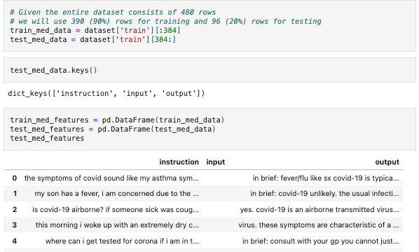

# LLM Experiments
This repository experiments with LLM (Large Language Models) and fundamental training datasets for these models and other models such as RAG (Retrieval Augmented Generation) models. It experiments with tokenization, fine-tuning, code interpretation, and more. 

Link to credit to the original video and notebook in description: https://www.youtube.com/watch?v=sYliwvml9Es

Link to credit the original dataset: https://huggingface.co/knowrohit07

## The Data (Used in Fine-tuning)
Medical-like data found on HuggingFace datasets were used to experiment with model making.

## Experiment| Instruction Tuning & OpenOrca

I used the OpenOrca dataset to experiment with how ChatGPT is able to reason. 

In the first example, ChatGPT is expected to answer from one of two succinct options (yes & no) and answers correctly. The system prompt here is basic and simply asks GPT to follow instructions well.

In the second example, ChatGPT is expected (according to the system prompt) to answer 2) Rebecca... and further explain and detail their answer. ChatGPT answered correctly, but did not follow the system prompt to explain their answer.

Finally, in the third example, the system prompt primes ChatGPT & it is expected to answer both succinctly and detail their answer afterwards in a tone as if explaining to a five-year-old. ChatGPT answered correctly and detailed in the proper tone.

## Experiment | Token Generation
My hypothesis was that filler words are closely related and thus have similar token values when compared to normal language. I ran a simple test and found filler words are 50% as large as regular language words. A bootstrap or p-value A/B test was not conducted but could be used to make a valid conclusion.

## Experiment | Advanced Data Analysis & Reasoning
I used the OpenOrca dataset (used to test popular large language models) to evaluate ChatGPT's ability (in the web browser) to answer the questions and evaluate its' reasoning ability. I found that the system prompt is useful and determining the method by which ChatGPT/LLM's answer questions, and that the accuracy of the answer is much better than the LLM's ability to answer in the requested tone/fashion.

## Experiment | OpenAI API & Code Interpretation
I used the OpenAI API to submit queries to ChatGPT via Python code and then recieve the response and execute code interpretation abilities found via the model locally. The reason the code interpretation abilities must be tested locally is that ChatGPT does not execute code remotely or in-server. This also means the code to be interpreted had to be coded and then decoded using string formatting and methods.

## Experiment | PyTorch, RAG, and LLaMA
Using HuggingFace datasets and transformer packages, models were built locally. LLaMA was attempted however I did not request access in-time for this assignment and was not evaluated. Instead, the OpenSource StableBeluga model was evaluated. To experiment with RAG (retrieval augmented generation), text data features in OpenOrca/the data sample were used to format system prompt training samples and then submit to the model for inference.

## Experiment | Finetuning
This section required evaluating another open-source model, or training a new base model with which to fine-tune the StableBeluga model with. Demonstration code was included, however, since I would like to fine-tune a model using the data using a base model, and that requires further training, this section was not executed and will be reserved for later use.

## LLaMA.cpp
This experiment was not executed since it requires the closed-source LLaMA model access which I requested and have not recieved yet.
