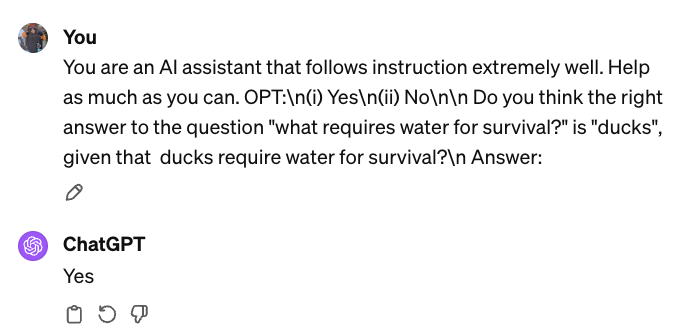
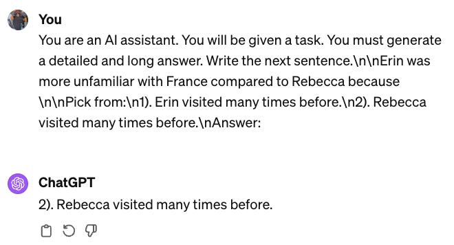
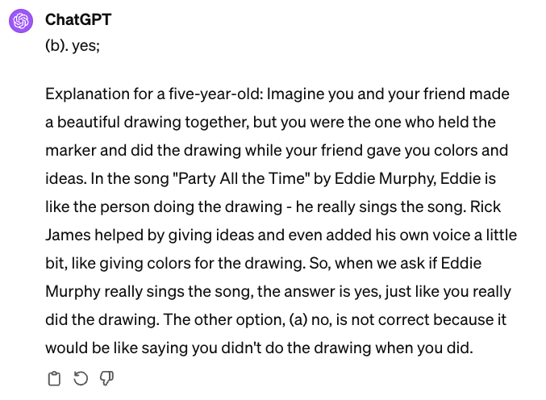

# LLM Experiments
This repository experiments with LLM (Large Language Models) and fundamental training datasets for these models and other models such as RAG (Retrieval Augmented Generation) models. It experiments with tokenization, fine-tuning, code interpretation, and more. 

Link to credit to the original video and notebook in description: https://www.youtube.com/watch?v=sYliwvml9Es

Link to credit the original dataset: https://huggingface.co/knowrohit07

## OpenOrca

I used the OpenOrca dataset to experiment with how ChatGPT is able to reason. 

In the first example, ChatGPT is expected to answer from one of two succinct options (yes & no) and answers correctly. The system prompt here is basic and simply asks GPT to follow instructions well.

In the second example, ChatGPT is expected (according to the system prompt) to answer 2) Rebecca... and further explain and detail their answer. ChatGPT answered correctly, but did not follow the system prompt to explain their answer.

Finally, in the third example, the system prompt primes ChatGPT & it is expected to answer both succinctly and detail their answer afterwards in a tone as if explaining to a five-year-old. ChatGPT answered correctly and detailed in the proper tone.

